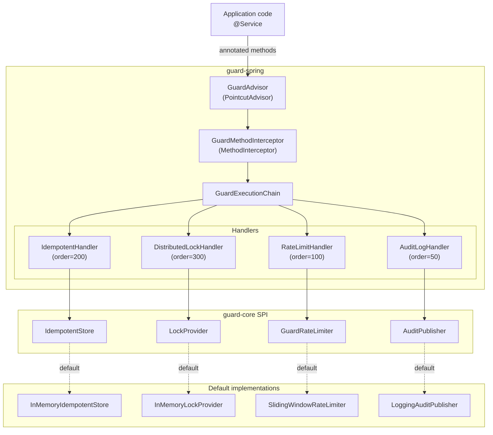
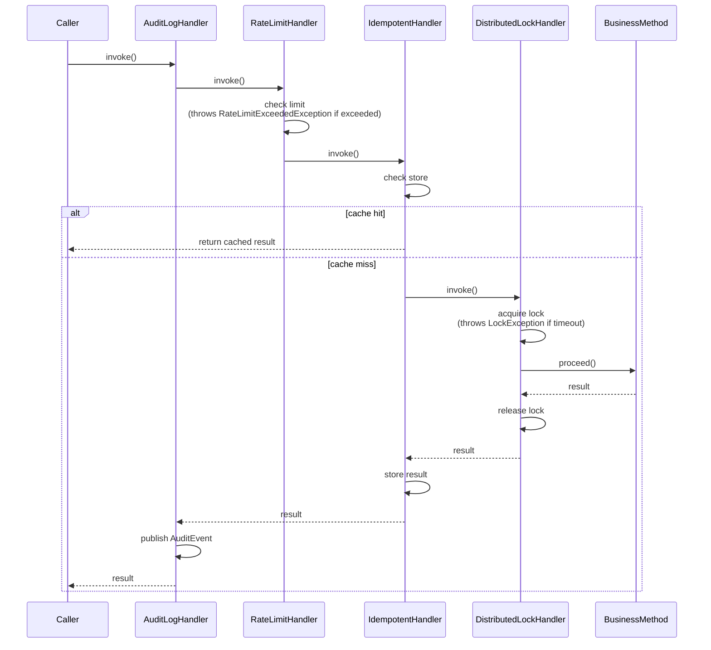

# Guard

**Annotation-driven method guard framework for Spring Boot 4.**

Guard wraps your methods with composable, ordered guards — idempotency, distributed locking, rate limiting, and audit logging — using a single dependency and Spring AOP. Inspired by ShedLock, Spring Security, Spring Transaction, and Resilience4j.

---

## Quick start

```xml
<dependency>
    <groupId>com.nduyhai</groupId>
    <artifactId>guard-spring-boot-starter</artifactId>
    <version>1.0.0</version>
</dependency>
```

```java
@EnableGuard
@SpringBootApplication
public class MyApplication { }

@Service
public class PaymentService {

    @AuditLog(action = "CREATE_PAYMENT")
    @RateLimit(key = "#merchantId", limit = 100, window = "1m")
    @Idempotent(key = "#request.orderId()", ttl = "10m")
    @DistributedLock(key = "'payment:' + #request.orderId()", leaseTime = "30s")
    public PaymentResponse createPayment(PaymentRequest request, String merchantId) {
        return new PaymentResponse(request.orderId(), "SUCCESS", "Processed");
    }
}
```

---

## Module structure

```
guard
├── guard-core                       Pure Java SPI — no Spring dependency
├── guard-spring                     AOP implementation + Spring Modulith modules
├── guard-spring-boot-autoconfigure  Boot auto-configuration, RuntimeHints, properties
├── guard-spring-boot-starter        Dependency aggregator (one import for users)
└── guard-samples                    Runnable demo (REST + all four guards)
```

---

## Architecture

### Component diagram



### Execution sequence



---

## Annotations

| Annotation | Key attribute | Notes |
|---|---|---|
| `@AuditLog` | `action` | Captures result/exception post-execution. Outermost handler. |
| `@RateLimit` | `key` (SpEL) | Sliding-window algorithm. Throws `RateLimitExceededException`. |
| `@Idempotent` | `key` (SpEL), `ttl` | Caches first successful result. Does NOT cache exceptions. |
| `@DistributedLock` | `key` (SpEL), `waitTime`, `leaseTime` | Released in `finally`. Throws `LockException` on timeout. |

All `key` attributes accept SpEL expressions evaluated against method parameters:
```java
@Idempotent(key = "#request.orderId()")   // method reference on record component
@RateLimit(key = "#merchantId")            // direct parameter name
@DistributedLock(key = "'prefix:' + #id") // string concatenation
```

Duration attributes accept Guard shorthand (`10s`, `5m`, `2h`, `1d`) or ISO-8601 (`PT10M`).

---

## Configuration

```yaml
guard:
  enabled: true
  idempotent:
    default-ttl: 10m
  lock:
    default-wait-time: 5s
    default-lease-time: 30s
  rate-limit:
    default-limit: 100
    default-window: 1m
```

---

## Replacing default implementations

Every SPI bean is registered with `@ConditionalOnMissingBean`. Declare your own bean to override:

```java
@Bean
public IdempotentStore redisIdempotentStore(StringRedisTemplate redis) {
    // return new RedisIdempotentStore(redis);
}

@Bean
public LockProvider redisLockProvider(RedisConnectionFactory factory) {
    // return new RedisLockProvider(factory);
}

@Bean
public AuditPublisher kafkaAuditPublisher(KafkaTemplate<String, AuditEvent> kafka) {
    // return event -> kafka.send("audit-events", event);
}
```

### Redis idempotent store (example skeleton)

```java
public class RedisIdempotentStore implements IdempotentStore {
    private final StringRedisTemplate redis;

    @Override
    public Optional<Object> get(String key) {
        String value = redis.opsForValue().get("guard:idempotent:" + key);
        return Optional.ofNullable(value);
    }

    @Override
    public void put(String key, Object result, Duration ttl) {
        redis.opsForValue().set("guard:idempotent:" + key,
            serialize(result), ttl);
    }
}
```

### Redis lock provider (example skeleton)

```java
public class RedisLockProvider implements LockProvider {
    private final StringRedisTemplate redis;

    @Override
    public LockHandle acquire(LockOperation operation) {
        String redisKey = "guard:lock:" + operation.key();
        Boolean acquired = redis.opsForValue()
            .setIfAbsent(redisKey, "1", operation.leaseTime());
        if (!Boolean.TRUE.equals(acquired)) {
            throw new LockException("Cannot acquire Redis lock: " + operation.key());
        }
        return new RedisLockHandle(redis, redisKey);
    }
}
```

---

## SPI extension points

| Interface | Package | Purpose |
|---|---|---|
| `IdempotentStore` | `guard-core` | Persist/retrieve idempotent results |
| `LockProvider` | `guard-core` | Acquire/release distributed locks |
| `GuardRateLimiter` | `guard-core` | Rate-limit token acquisition |
| `AuditPublisher` | `guard-core` | Publish audit events |
| `IdempotentKeyResolver` | `guard-spring` | Custom key derivation logic |
| `LockKeyResolver` | `guard-spring` | Custom lock-key derivation |
| `RateLimitKeyResolver` | `guard-spring` | Custom rate-limit key derivation |
| `GuardHandler` | `guard-spring` | Plug in entirely new guard behaviour |

---

## Spring Modulith

Guard uses Spring Modulith module boundaries to enforce clean separation. Run the
built-in verification test in `guard-spring`:

```java
@Test
void verifyModularStructure() {
    ApplicationModules.of(GuardApplication.class).verify();
}
```

Module boundaries prevent, for example, the `ratelimit` module from directly reaching
into `idempotent` internals.

---

## Releasing

Guard is published to [Maven Central](https://central.sonatype.com/artifact/com.nduyhai/guard-spring-boot-starter) via a GitHub Actions workflow that fires on version tags.

### CI/CD overview

| Workflow | Trigger | What it does |
|---|---|---|
| `ci.yml` | Push / PR to `main` | Compiles, runs all tests, uploads Surefire reports |
| `release.yml` | Push tag `v*.*.*` or manual dispatch | Sets version, signs artifacts, publishes to Maven Central, creates GitHub Release |

### One-time setup for maintainers

**1. GPG key**

```bash
gpg --full-generate-key                                  # RSA 4096, use your email
gpg --list-secret-keys --keyid-format LONG               # note YOUR_KEY_ID
gpg --keyserver keyserver.ubuntu.com --send-keys <YOUR_KEY_ID>
gpg --armor --export-secret-keys <YOUR_KEY_ID>           # copy this into GitHub secret
```

**2. Maven Central token**

Log in to [central.sonatype.com](https://central.sonatype.com) → Account → **Generate User Token**. Copy the username and password.

**3. GitHub repository secrets**

Go to **Settings → Secrets and variables → Actions** and add:

| Secret | Value |
|---|---|
| `GPG_PRIVATE_KEY` | Output of `gpg --armor --export-secret-keys <YOUR_KEY_ID>` |
| `GPG_PASSPHRASE` | Passphrase chosen during key generation |
| `CENTRAL_USERNAME` | Token username from central.sonatype.com |
| `CENTRAL_PASSWORD` | Token password from central.sonatype.com |

### Version management

The project uses the [versions-maven-plugin](https://www.mojohaus.org/versions/versions-maven-plugin/) to keep all module versions in sync. `generateBackupPoms` is disabled globally so no `.versionsBackup` files are created.

```bash
# Set an explicit version across all modules
./mvnw versions:set -DnewVersion=1.1.0

# Bump to next patch snapshot automatically (1.0.0 → 1.0.1-SNAPSHOT)
./mvnw versions:set -DnextSnapshot=true

# After setting, also update the <guard.version> property in the root pom.xml
# to match — then commit both changes together.
```

### How to cut a release

```bash
# 1. Set release version (drop -SNAPSHOT) and commit
./mvnw versions:set -DnewVersion=1.1.0
# also update <guard.version>1.1.0</guard.version> in root pom.xml
git commit -am "release: 1.1.0"

# 2. Tag and push — this triggers the release workflow
git tag v1.1.0
git push origin main --tags

# 3. Bump to next development version
./mvnw versions:set -DnextSnapshot=true
# also update <guard.version>1.1.1-SNAPSHOT</guard.version> in root pom.xml
git commit -am "chore: start 1.1.1-SNAPSHOT development"
git push origin main
```

The workflow sets the Maven version from the tag, builds and GPG-signs all jars, uploads to the Central Portal, waits until the release is **published**, and then creates a GitHub Release with auto-generated notes. No manual steps are needed after pushing the tag.

To trigger a release manually (e.g. to re-publish without a new tag), use **Actions → Release → Run workflow** and supply the version tag.

---

## Tech stack

| Concern | Technology |
|---|---|
| Language | Java 25 |
| Framework | Spring Boot 4 / Spring Framework 7 |
| Build | Maven multi-module |
| APIs | Jakarta EE 11 |
| Module validation | Spring Modulith |
| Native image | `RuntimeHintsRegistrar` + `@RegisterReflectionForBinding` |
| Threading | Virtual-thread friendly (`ReentrantLock` over `synchronized`) |
